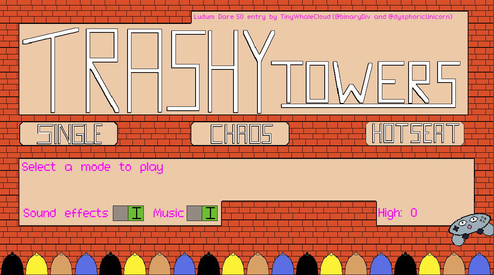
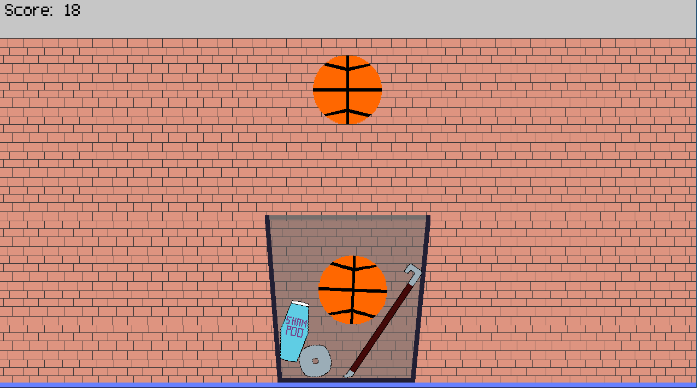
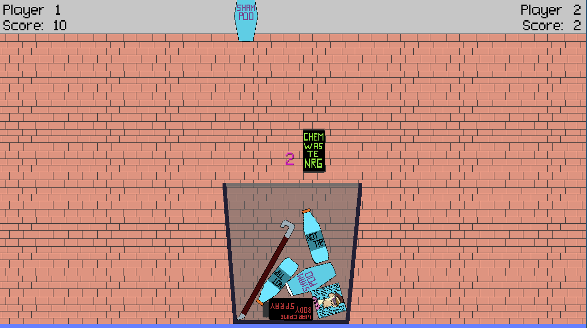
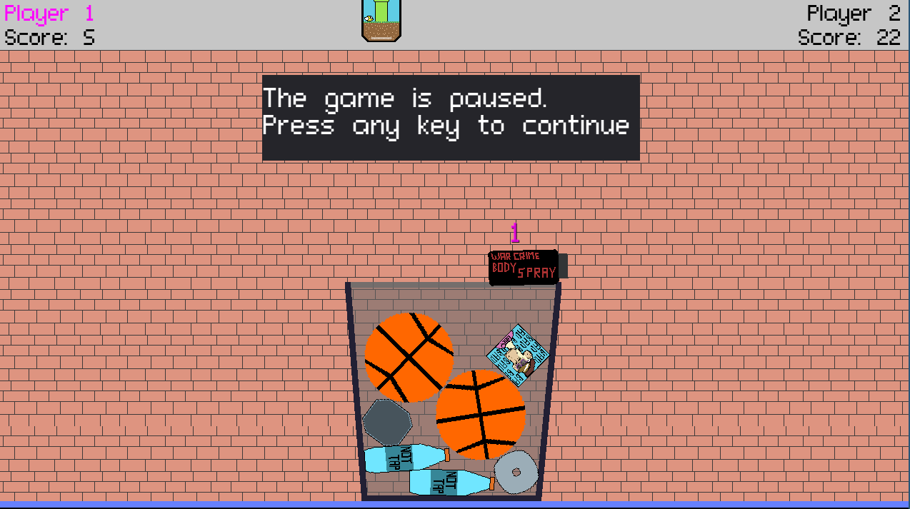

# Trashy Towers

A Tricky Towers inspired game where you have to stack trash with your roommates until someone spills it.

Entry for the [Ludum Dare 50](https://ldjam.com/events/ludum-dare/50) with the theme "Delay the inevitable".

This game is playable with a keyboard or one or more gamepads.  
The native Linux build has some difficult to reproduce issues with the gamepad disconnecting.  
If this happens, try the web build instead.

## Setting

Taking out the trash is a pretty annoying chore.  
You've got to put on street clothes and go into this terrifying place called "outside".  
That's why in many living arrangements, this is procrastinated until the trash spills out of the can.  
By smartly placing your trash you can "delay the inevitable" spilling until hopefully someone else spills it so that
it's their problem.  
This is a game about that.

## Game modes

### Single

Play alone to beat your highscore.  
This may be the least fun mode of play but since having friends around to play games is a rare privilege, there had to
be some way to try the game alone.

If you somehow can (Parsec/ actually meeting people/ whatever else) also try the other modes!

### Chaos

A chaotic mode in which you and a friend try to put trash in the same can simultaneously.  
Whoever has dropped the last piece before the heap spills loses.

**Hot tip**: If you see something moving after the other player has set it down, you can slow down your own trash
falling.  
If you don't their trash might land after yours does, and you lose the game.  
Imagine this being a bit like when someone has put in something compressed that extends over time; if you happen to have
thrown something in the trash before it's done extending, it will look like the spilling was your fault.

### Hotseat

Take turns with a friend putting trash in the same can.  
Whoever has dropped the last piece before the heap spills loses.

## Technology used

- Game Engine: [Godot](https://godotengine.org/)
- Sprite editing: [Aseprite](https://www.aseprite.org/)
- SFX: [sfxr](https://www.drpetter.se/project_sfxr.html)
- Music: [GarageBand iOS](https://apps.apple.com/us/app/garageband/id408709785)
